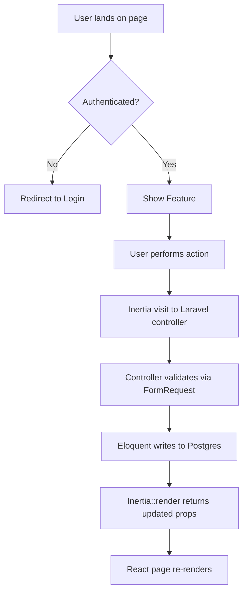

Before doing anything else, apply this agent guard:

- If the current agent is `agent-x44-mentor`, continue normally.
- If the current agent is not `agent-x44-mentor`, first decide whether the request would change the codebase, workflow files, or repository behavior.
- If the request is codebase-changing, do not create or update a spec. Reply: `This repository requires implementation-oriented work to be requested through Agent-X44-Mentor. Please rerun this command using Agent-X44-Mentor.` You may add brief guidance, but do not progress the workflow.
- If the request is a pure question, read-only exploration, or a one-line doc/comment typo fix, you may help without redirecting, but do not create a spec unless the current agent is `agent-x44-mentor`.

Based on the clarified task, create a spec document and save it to `docs/specs/<YYYY-MM-DD>-SPEC-<task-slug>.md`.

Do not proceed if the task has not been clarified yet. If requirements are still ambiguous in a way that changes scope or behavior, stay in `/task` and say what is still missing.

Use this format exactly. Fill in every section — if a section does not apply, write "N/A" with a one-line reason rather than deleting it. Leave the **Open Questions** section populated with any remaining ambiguity or assumption that still needs owner confirmation.

---

# Feature: [Name]

**Status:** Draft | In Review | Approved
**Owner:** [Author]
**Last Updated:** YYYY-MM-DD

---

## Goal

One sentence: what does this feature achieve and why does it matter?

## Stakeholders

- **Requestor:**
- **Users affected:**
- **Teams involved:** Backend, Frontend

---

## User Stories

### Story 1: [Short Title]

**As a** [type of user],
**I want to** [perform an action],
**So that** [I achieve a benefit].

#### Acceptance Criteria

- **Given** [initial context], **When** [user action], **Then** [expected outcome]
- **Given** [initial context], **When** [user action], **Then** [expected outcome]

---

## Data Requirements

| Field | Type | Required | Constraints | Notes |
| ----- | ---- | -------- | ----------- | ----- |
|       |      |          |             |       |

---

## Flow Diagram

---

## Inertia Routes / Controller Actions

> All routes live in `routes/web.php` under the `web` middleware group. No `api.php` routes.

| Method | URI                 | Controller Action          | Inertia Page Component |
| ------ | ------------------- | -------------------------- | ---------------------- |
| GET    | /resource           | ResourceController@index   | Resource/Index         |
| GET    | /resource/create    | ResourceController@create  | Resource/Create        |
| POST   | /resource           | ResourceController@store   | —                      |
| GET    | /resource/{id}/edit | ResourceController@edit    | Resource/Edit          |
| PUT    | /resource/{id}      | ResourceController@update  | —                      |
| DELETE | /resource/{id}      | ResourceController@destroy | —                      |

---

## Edge Cases

- What happens if the user submits the form twice quickly?
- What happens if the network request fails?
- What if the resource belongs to a different user?

---

## Out of Scope

- Explicitly list what will NOT be built in this version

---

## Open Questions

❓ [Question] — Owner: [Name] — Due: [Date]

---

## Dependencies

- **Depends on:** [feature or service that must exist first]
- **Blocks:** [feature or service waiting on this]

---

After saving, output exactly this sentence with the real filename substituted for the placeholders: `Spec saved to docs/specs/<YYYY-MM-DD>-SPEC-<slug>.md. Please review and reply 'approved' to proceed.`

Do NOT write any code or implement yet.
