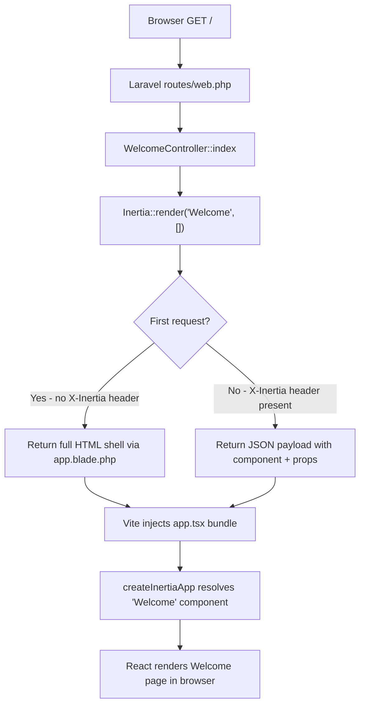

# Feature: Laravel 13 Skeleton Scaffold

**Status:** Approved
**Owner:** rjasino-fs
**Last Updated:** 2026-06-06

---

## Goal

Bootstrap a bare Laravel 13 application at `apps/big-brother/` with Inertia.js 2.x, React 19, and TypeScript manually wired — giving the project a confirmed-working full-stack base on which all future features will be built.

## Stakeholders

- **Requestor:** rjasino-fs
- **Users affected:** Developers working on the Big Brother SMS (no end-user impact at this stage)
- **Teams involved:** Backend, Frontend

---

## User Stories

### Story 1: Developer can boot the full stack locally

**As a** developer,
**I want to** run `php artisan serve` and `npm run dev` from `apps/big-brother/`,
**So that** I can confirm Laravel, Inertia, React, and Postgres are all wired together before writing any feature code.

#### Acceptance Criteria

- **Given** Docker Postgres is running on host port 5433, **When** `php artisan serve` is started, **Then** the app responds on `http://localhost:8000` without a PHP or DB error.
- **Given** the dev server is running, **When** a browser visits `/`, **Then** a React-rendered "Welcome" page is returned (not a Blade HTML page, not a 500 error).
- **Given** the dev server is running, **When** `npm run dev` starts Vite, **Then** HMR connects and no TypeScript or module-resolution errors appear in the console.
- **Given** the `.env` file is present and correctly configured, **When** `php artisan config:clear` is run, **Then** `DB_CONNECTION=pgsql`, `DB_PORT=5433`, and the correct DB credentials are in effect.

---

## Data Requirements

| Field | Type | Required | Constraints | Notes |
| ----- | ---- | -------- | ----------- | ----- |
| DB_CONNECTION | env string | Yes | Must be `pgsql` | Set in `.env` |
| DB_HOST | env string | Yes | `127.0.0.1` | Docker forwards to container |
| DB_PORT | env int | Yes | `5433` | Non-default to avoid collision with local Postgres |
| DB_DATABASE | env string | Yes | `big_brother` | Matches `docker-compose.yml` default |
| DB_USERNAME | env string | Yes | `bigbrother` | Matches `docker-compose.yml` default |
| DB_PASSWORD | env string | Yes | `secret` | Matches `docker-compose.yml` default |

No database tables are created in this task. The `.env` values above only need to be correct; no `php artisan migrate` is run.

---

## Flow Diagram

---

## Inertia Routes / Controller Actions

> All routes live in `routes/web.php` under the `web` middleware group. No `api.php` routes.

| Method | URI | Controller Action | Inertia Page Component |
| ------ | --- | ----------------- | ---------------------- |
| GET | / | WelcomeController@index | Welcome |

All three module route groups (Enrollment, Load Assignment, Attendance) are out of scope for this task and will be added in subsequent feature specs.

---

## Implementation Checklist

The following steps will be executed in order:

1. **`composer create-project`** — `composer create-project laravel/laravel apps/big-brother` (Laravel 13, PHP 8.4 minimum).
2. **Clean up defaults** — Remove `resources/views/welcome.blade.php`; remove any Breeze/Jetstream references; confirm no starter kit was pulled in.
3. **Server-side Inertia** — `composer require inertiajs/inertia-laravel`; publish and register `HandleInertiaRequests` middleware in the `web` middleware group in `bootstrap/app.php` (Laravel 13 uses the new application bootstrap file, not `app/Http/Kernel.php`).
4. **Root Blade view** — Create `resources/views/app.blade.php` with `@inertia`, `@viteReactRefresh`, and `@vite(['resources/js/app.tsx'])` directives.
5. **Client-side packages** — `npm install @inertiajs/react react react-dom`; `npm install --save-dev @vitejs/plugin-react typescript @types/react @types/react-dom tailwindcss @tailwindcss/vite`.
6. **`vite.config.ts`** — Configure `@vitejs/plugin-react` and `@tailwindcss/vite`; set the input to `resources/js/app.tsx`.
7. **`tsconfig.json`** — Strict mode on (`"strict": true`), `jsx: "react-jsx"`, path aliases for `@/` → `resources/js/`.
8. **`resources/js/app.tsx`** — `createInertiaApp` resolving pages from `./Pages/**`.
9. **`resources/js/Pages/Welcome.tsx`** — Minimal functional component returning a `<h1>Big Brother SMS</h1>` element styled with a Tailwind class (e.g. `text-2xl font-bold`); confirms React + Tailwind rendering end-to-end.
10. **`.env` + `.env.example`** — Set Postgres connection values; never commit `.env`; `.env.example` has all keys with placeholder values.
11. **Smoke-test route** — `Route::get('/', [WelcomeController::class, 'index'])` in `routes/web.php`; create `app/Http/Controllers/WelcomeController.php` returning `Inertia::render('Welcome')`.
12. **Manual boot check** — Start `php artisan serve` and `npm run dev`; confirm browser renders the React welcome page with no console errors.

---

## Edge Cases

- **PHP version mismatch** — If the installed PHP is below 8.4, `composer create-project` will fail. Stop and surface the error; do not proceed with an incompatible runtime.
- **Missing `pdo_pgsql` extension** — Laravel will boot but any DB call (including `php artisan migrate:status`) will throw. Detect by running `php -m | grep pdo_pgsql` before confirming success. Note: no migration is run in this task, so this is a soft check only — document it clearly if absent.
- **Port 5433 not reachable** — The `.env` is written correctly even if Docker is not running during scaffold. The smoke test only requires the HTTP stack; DB connectivity is not exercised until migrations run in a future task.
- **npm version < 10** — `package-lock.json` lockfile format may mismatch. Surface and stop rather than silently downgrading.
- **Vite / TypeScript type errors on first build** — If `npm run build` emits TS errors, resolve before declaring the scaffold complete; HMR may tolerate errors that production builds reject.

---

## Out of Scope

- Database migrations and schema creation — deferred to a dedicated migrations task.
- Eloquent models — deferred.
- Authentication (Breeze, Sanctum, Fortify) — explicitly deferred per user decision.
- Module controllers (Enrollment, Load Assignment, Attendance) — deferred.
- Inertia page components beyond the single `Welcome.tsx` smoke-test page — deferred.
- Factory and seeder files — deferred.
- Pest PHP test suite setup — deferred (Pest ships with Laravel 13 by default; no additional config needed now).
- Any UI component library beyond Tailwind CSS — not in scope.
- Docker containerization of the PHP app — user confirmed local PHP/Composer.

---

## Open Questions

✅ `npm run dev` (HMR) is sufficient for acceptance — production build not required in this task.

✅ Tailwind CSS will be installed and configured as part of this scaffold.

---

## Dependencies

- **Depends on:** Docker Compose Postgres service (`docker-compose.yml` — already present at repo root); local PHP 8.4 + Composer 2.x + npm 10.x.
- **Blocks:** All subsequent feature specs (Enrollment, Load Assignment, Attendance Monitoring) — none can be implemented until this scaffold is confirmed working.
