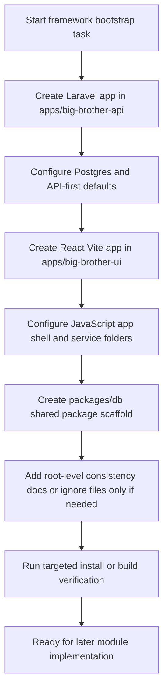

# Feature: Backend and Frontend Framework Bootstrap

**Status:** Approved
**Owner:** OpenCode
**Last Updated:** 2026-06-07

---

## Goal

Create a clean, runnable framework bootstrap for the Laravel backend, React frontend, and shared `packages/db` package so later module work can build on a consistent monorepo foundation.

## Stakeholders

- **Requestor:** User
- **Users affected:** Developers, students, and demo viewers working in this repository
- **Teams involved:** Backend, Frontend

---

## User Stories

### Story 1: Bootstrap the Backend Service

**As a** developer,
**I want to** scaffold the Laravel backend service with the agreed stack and repo structure,
**So that** the project has a stable API foundation for later module work.

#### Acceptance Criteria

- **Given** the current repo contains docs but no backend app, **When** the scaffold is implemented, **Then** `apps/big-brother-api` exists as a Laravel 13 application configured for PostgreSQL and local development.
- **Given** the backend scaffold is created, **When** a developer reviews the generated structure, **Then** it includes only baseline framework setup and starter organization for API work, not module-specific business logic or full CRUD flows.

### Story 2: Bootstrap the Frontend Service

**As a** developer,
**I want to** scaffold the React + Vite frontend service in JavaScript,
**So that** the project has a separate client app ready to consume the backend later.

#### Acceptance Criteria

- **Given** the current repo contains docs but no frontend app, **When** the scaffold is implemented, **Then** `apps/big-brother-ui` exists as a React 19 + Vite application using JavaScript ES6 modules.
- **Given** the frontend scaffold is created, **When** a developer reviews the structure, **Then** it includes baseline routing, app shell, and API service organization only, without completed module screens or business workflows.

### Story 3: Bootstrap the Shared Package Layer

**As a** developer,
**I want to** scaffold the shared `packages/db` package,
**So that** shared schema-facing contracts have a defined home before feature work begins.

#### Acceptance Criteria

- **Given** the monorepo structure in `docs/sdd.md`, **When** the scaffold is implemented, **Then** `packages/db` exists with a minimal package structure and public export entry.
- **Given** the shared package scaffold exists, **When** developers add later work, **Then** they have a single intended location for shared database-facing contracts rather than duplicating shapes across apps.

---

## Data Requirements

| Field | Type | Required | Constraints | Notes |
| ----- | ---- | -------- | ----------- | ----- |
| backend_framework | string | Yes | Must be Laravel 13.x | Matches `docs/sdd.md` |
| backend_language | string | Yes | Must target PHP 8.4+ | No feature-specific PHP code required yet |
| frontend_framework | string | Yes | Must be React 19.x | Separate app, not Inertia |
| frontend_language | string | Yes | Must be JavaScript ES6+ | Use `.js` and `.jsx` files |
| build_tool | string | Yes | Must be Vite 7.x | Frontend bootstrap only |
| database_engine | string | Yes | Must be PostgreSQL 16 | Config-ready, not full schema build |
| auth_baseline | string | Yes | Must be Sanctum-ready | Do not build full auth flows in this task |
| module_scope | array | Yes | Limited to Enrollment, Load Assignment, Attendance Monitoring | Used only to shape folder naming and starter structure |

---

## Flow Diagram

---

## Inertia Routes / Controller Actions

N/A - this project uses a decoupled React frontend and Laravel JSON API, so the scaffold should prepare `routes/api.php` and frontend routing instead of Inertia pages.

| Method | URI | Controller Action | Inertia Page Component |
| ------ | --- | ----------------- | ---------------------- |
| N/A | N/A | N/A | N/A |

---

## Edge Cases

- Composer or npm bootstrap commands may fail if the local toolchain is missing or version-mismatched.
- Laravel 13 package installation may need version-aware dependency choices if first-party packages lag or conflict.
- Frontend and backend environment files may need placeholder values only, not real secrets.
- The repo already has unrelated working tree changes in `.opencode/opencode.json`, which must remain untouched.
- Shared package exports must stay minimal so they do not imply a finalized contract before feature specs exist.

---

## Out of Scope

- Full CRUD endpoints, business rules, and validation for Enrollment, Load Assignment, or Attendance Monitoring
- Complete authentication flows such as login, registration, password reset, or role-specific dashboards
- Final database schema implementation for all documented entities
- Production deployment setup, CI/CD pipelines, or infrastructure hardening beyond local bootstrap
- UI polish beyond a basic working frontend shell

---

## Open Questions

N/A - user confirmed the scaffold should stay at framework default screens only.

---

## Dependencies

- **Depends on:** Existing repo docs in `docs/prd.md`, `docs/sdd.md`, and `docs/data_model.json`
- **Blocks:** Later feature specs and implementations for Enrollment, Load Assignment, Attendance Monitoring, and shared contract work in `packages/db`

---
