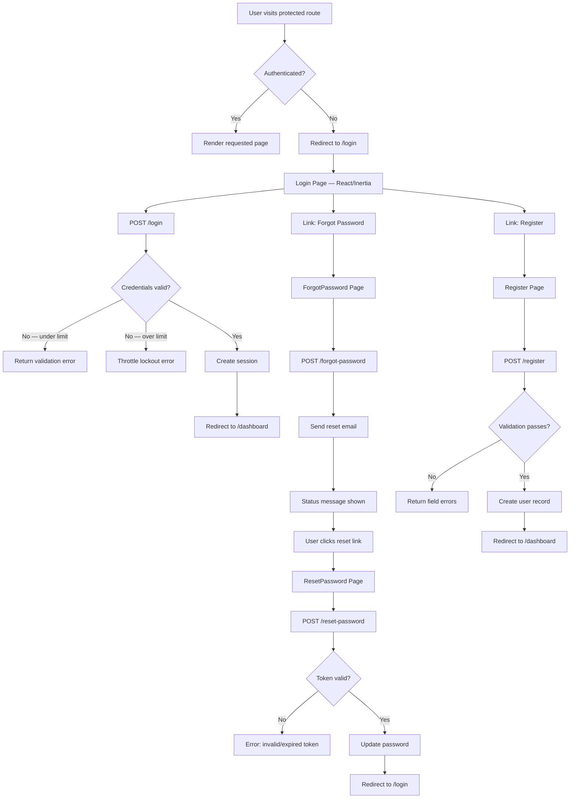

# Feature: Laravel Fortify Auth Scaffold

**Status:** Approved
**Owner:** rjasino-fs
**Last Updated:** 2026-06-07 (open questions resolved)

---

## Goal

Install and configure Laravel Fortify to provide session-based login, logout, registration, and password reset for Faculty and Registrar users, exposed through Inertia/React pages.

## Stakeholders

- **Requestor:** rjasino-fs
- **Users affected:** Faculty (instructors), Registrar (admin staff)
- **Teams involved:** Backend, Frontend

---

## User Stories

### Story 1: Login

**As a** Faculty or Registrar user,
**I want to** log in with my email and password,
**So that** I can access the school management system.

#### Acceptance Criteria

- **Given** I am unauthenticated, **When** I visit any protected route, **Then** I am redirected to `/login`
- **Given** I am on the login page, **When** I submit valid credentials, **Then** I am redirected to `/dashboard`
- **Given** I am on the login page, **When** I submit invalid credentials, **Then** I see a validation error and remain on `/login`
- **Given** I have failed login 5 times, **When** I attempt another login, **Then** Fortify locks me out and returns a throttle error message
- **Given** I check "Remember Me", **When** my session expires, **Then** I am still authenticated via the remember-me cookie

---

### Story 2: Logout

**As an** authenticated Faculty or Registrar user,
**I want to** log out,
**So that** my session is terminated and my account is secured.

#### Acceptance Criteria

- **Given** I am authenticated, **When** I submit the logout action (POST `/logout`), **Then** my session is invalidated and I am redirected to `/login`

---

### Story 2b: Role-Aware Dashboard

**As an** authenticated user,
**I want to** see a dashboard tailored to my role,
**So that** I only see actions and links relevant to my work.

#### Acceptance Criteria

- **Given** I am logged in as a `registrar`, **When** I land on `/dashboard`, **Then** I see the Enrollment module entry point and no Load Assignment actions
- **Given** I am logged in as a `faculty`, **When** I land on `/dashboard`, **Then** I see the Load Assignment and Attendance module entry points and no Enrollment actions

---

### Story 3: Account Creation (Admin Only)

**As an** authenticated admin (registrar),
**I want to** create user accounts for Faculty and Registrar actors,
**So that** only authorized individuals can log in to the system.

#### Acceptance Criteria

- **Given** I am unauthenticated, **When** I visit `/register`, **Then** I receive a 403 or am redirected to `/login` — public self-registration is disabled
- **Given** I am authenticated as a `registrar`, **When** I submit a valid name, email, password, password confirmation, and role via the account creation form, **Then** the account is created and I see a success message
- **Given** I submit an email already in use, **When** the form is submitted, **Then** I receive a validation error: "The email has already been taken."
- **Given** I submit mismatched passwords, **When** the form is submitted, **Then** I receive a validation error on the password field
- **Given** I select role `faculty`, **When** the account is created, **Then** `users.role` is set to `faculty` and `faculty_id` remains `null` until linked separately
- **Given** I select role `registrar`, **When** the account is created, **Then** `users.role` is set to `registrar` and `faculty_id` is `null`

---

### Story 4: Password Reset

**As an** existing Faculty or Registrar user who forgot my password,
**I want to** request a password reset link via email,
**So that** I can regain access to my account.

#### Acceptance Criteria

- **Given** I submit a valid email on the Forgot Password page, **When** the form is submitted, **Then** a reset link is sent to that email and I see a status message
- **Given** I submit an email that does not exist, **When** the form is submitted, **Then** I receive a validation error (Fortify default: "We can't find a user with that email address.")
- **Given** I click a valid reset link, **When** I submit a new password, **Then** my password is updated and I am redirected to `/login`
- **Given** I use an expired or invalid reset token, **When** I attempt to reset, **Then** I see an error and the reset is rejected

---

## Data Requirements

### `users` table (new — migration required)

| Field            | Type         | Required | Constraints                                    | Notes                                      |
| ---------------- | ------------ | -------- | ---------------------------------------------- | ------------------------------------------ |
| `id`             | bigint       | yes      | PK, auto-increment                             |                                            |
| `name`           | varchar(150) | yes      |                                                | Display name                               |
| `email`          | varchar(150) | yes      | unique                                         | Used as login identifier                   |
| `password`       | varchar(255) | yes      |                                                | bcrypt-hashed by Fortify                   |
| `role`           | varchar(20)  | yes      | `faculty` or `registrar`                       | Added to Fortify's default `users` table   |
| `faculty_id`     | bigint       | no       | nullable FK → `faculty.id`, set null on delete | Populated separately; null at registration |
| `remember_token` | varchar(100) | no       | nullable                                       | Fortify remember-me support                |
| `created_at`     | timestamp    | yes      |                                                |                                            |
| `updated_at`     | timestamp    | yes      |                                                |                                            |

### `password_reset_tokens` table

Standard Laravel table created by the default migration. No changes needed.

---

## Flow Diagram

---

## Inertia Routes / Controller Actions

> All routes live in `routes/web.php`. Fortify registers its own backend routes automatically. The table below covers the Inertia view routes that render the React pages.

| Method | URI                       | Handler                                               | Inertia Page Component |
| ------ | ------------------------- | ----------------------------------------------------- | ---------------------- |
| GET    | `/login`                  | Fortify view route                                    | `Auth/Login`           |
| POST   | `/login`                  | Fortify (internal)                                    | —                      |
| POST   | `/logout`                 | Fortify (internal)                                    | —                      |
| GET    | `/register`               | `UserController@create` (auth + registrar middleware) | `Auth/Register`        |
| POST   | `/register`               | `UserController@store` (auth + registrar middleware)  | —                      |
| GET    | `/forgot-password`        | Fortify view route                                    | `Auth/ForgotPassword`  |
| POST   | `/forgot-password`        | Fortify (internal)                                    | —                      |
| GET    | `/reset-password/{token}` | Fortify view route                                    | `Auth/ResetPassword`   |
| POST   | `/reset-password`         | Fortify (internal)                                    | —                      |
| GET    | `/dashboard`              | `DashboardController@index`                           | `Dashboard`            |

Fortify view routes are registered via `Fortify::loginView()`, `Fortify::registerView()`, etc. in `FortifyServiceProvider`.

---

## Backend Implementation Checklist

- [ ] Install `laravel/fortify` via Composer
- [ ] Publish Fortify config (`config/fortify.php`) and service provider
- [ ] Register `FortifyServiceProvider` in `bootstrap/providers.php`
- [ ] Configure `config/fortify.php`:
  - `features`: enable `login`, `registration`, `resetPasswords`; disable `emailVerification`, `twoFactorAuthentication`, `updateProfileInformation`, `updatePasswords`
  - `home`: set to `/dashboard`
  - `guard`: `web`
- [ ] Disable Fortify's public `/register` route; handle registration via `UserController` behind `auth` + role check
- [ ] Create `CreateNewUser` action (app/Actions/Fortify/CreateNewUser.php) — extend to write `role` column
- [ ] Create `UserController` with `create` and `store` actions (protected: authenticated registrar only)
- [ ] Create migration for `users` table with `role` varchar(20) and nullable `faculty_id` FK
- [ ] Create `User` Eloquent model implementing `Authenticatable`
- [ ] Add `HasFactory`, `Notifiable` traits; cast `password` as hashed
- [ ] Create `DashboardController` returning `Inertia::render('Dashboard')`
- [ ] Protect `/dashboard` with `auth` middleware in `routes/web.php`
- [ ] Register Fortify view callbacks in `FortifyServiceProvider`

## Frontend Implementation Checklist

- [ ] `resources/js/Pages/Auth/Login.tsx`
- [ ] `resources/js/Pages/Auth/Register.tsx` — includes role selector (`faculty` | `registrar`); only reachable by authenticated registrar
- [ ] `resources/js/Pages/Auth/ForgotPassword.tsx`
- [ ] `resources/js/Pages/Auth/ResetPassword.tsx`
- [ ] `resources/js/Pages/Dashboard.tsx` — role-aware: renders Enrollment entry for `registrar`, Load Assignment + Attendance entry for `faculty`
- [ ] Shared `InputError`, `InputLabel`, `TextInput`, `PrimaryButton` components (reusable across modules)

---

## Edge Cases

- **Double-submit on login/register:** Fortify's built-in throttle handles repeated POST attempts. The React form should disable the submit button on first click (loading state).
- **Network failure on form submit:** Inertia surfaces server errors through the `errors` prop; display them inline per field.
- **Reset link reuse:** Fortify invalidates the token after first use — subsequent clicks show an expired-token error.
- **Registrar registering with a faculty email:** No automatic `faculty_id` linkage occurs at registration. Linking is out of scope for this task.
- **Inactive faculty account:** `users` table is independent of `faculty.status`. A faculty user can have an auth account even if `faculty.status = inactive`. Enforcement is out of scope.

---

## Out of Scope

- Email verification (`MustVerifyEmail`) — disabled in Fortify config
- Two-factor authentication — disabled in Fortify config
- Public self-registration — disabled; account creation is registrar-only
- Profile update / password change from within the app
- Role-based route protection middleware (separate task; this task only scaffolds auth)
- Linking `users.faculty_id` to an existing faculty record at registration
- Student authentication (students are not system users in this demo)
- API token authentication (Sanctum token guard)

---

## Open Questions

✅ **Resolved 2026-06-07** — `/dashboard` is a shared route; the React page conditionally renders role-appropriate module entry points based on `auth.user.role` passed via Inertia shared props.

✅ **Resolved 2026-06-07** — Registration is admin-only. Public self-registration is disabled. Only an authenticated `registrar` can create new user accounts via `UserController`.

---

## Dependencies

- **Depends on:** Laravel 13 + Inertia 2 + React 19 skeleton (already scaffolded in `apps/big-brother/`)
- **Depends on:** `faculty` table existing (FK target for `users.faculty_id`)
- **Blocks:** Role-based middleware / route guards (future task)
- **Blocks:** Load Assignment module (requires authenticated Faculty actor)
- **Blocks:** Enrollment module (requires authenticated Registrar actor)
