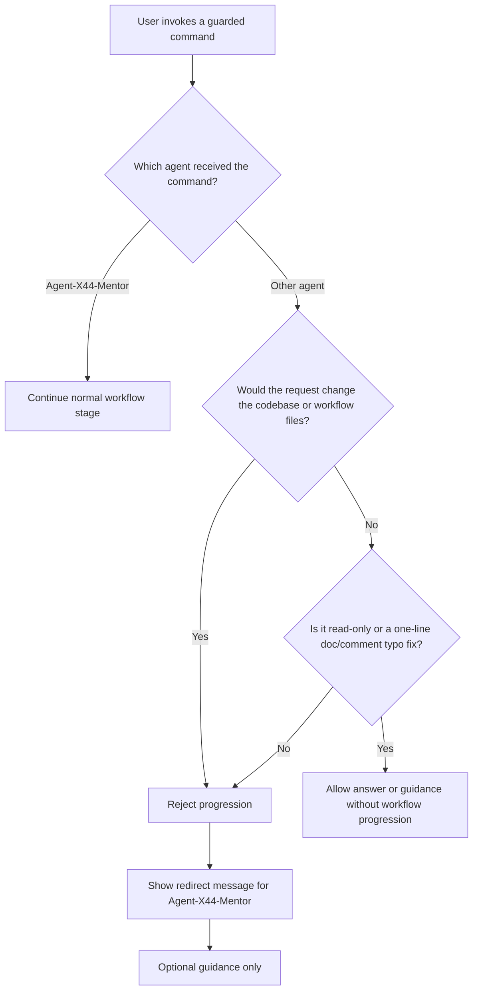

# Feature: Non-Mentor Agent Command Guard

**Status:** Approved
**Owner:** rjasino-fs
**Last Updated:** 2026-06-07

---

## Goal

Ensure codebase-changing workflow commands only progress when requested through `Agent-X44-Mentor`, so the repository keeps one visible orchestrator for implementation work.

## Stakeholders

- **Requestor:** User
- **Users affected:** Repository contributors, students following the workflow demo, and any agent operator using custom commands
- **Teams involved:** Backend, Frontend, Workflow

---

## User Stories

### Story 1: Reject codebase-changing workflow requests from other agents

**As a** repository operator,
**I want to** stop `/task`, `/spec`, `/implement`, and `/commit` from progressing when a non-mentor agent is asked to perform codebase-changing work,
**So that** implementation work stays inside the visible workflow owned by `Agent-X44-Mentor`.

#### Acceptance Criteria

- **Given** `/task`, `/spec`, `/implement`, or `/commit` is invoked through an agent other than `agent-x44-mentor`, **When** the request would change application code, workflow files, or other repository behavior, **Then** the command rejects progression and tells the user to rerun the command using `Agent-X44-Mentor`.
- **Given** a non-mentor agent receives a codebase-changing request through one of the guarded commands, **When** it responds, **Then** it may give guidance but must not create a spec, implement code, or continue workflow progression.

### Story 2: Allow skip-eligible work through other agents

**As a** repository operator,
**I want to** allow non-mentor agents to continue handling read-only or trivial requests,
**So that** simple questions and tiny typo fixes do not get blocked unnecessarily.

#### Acceptance Criteria

- **Given** `/task`, `/spec`, `/implement`, or `/commit` is invoked through a non-mentor agent, **When** the request is a pure question, read-only exploration, or a one-line doc/comment typo fix, **Then** the command may answer or guide without redirecting to `Agent-X44-Mentor`.
- **Given** a request mixes guidance with codebase-changing intent, **When** a non-mentor agent evaluates it, **Then** it treats the request as guarded work and refuses to progress the workflow.

---

## Data Requirements

| Field | Type | Required | Constraints | Notes |
| ----- | ---- | -------- | ----------- | ----- |
| guarded_commands | array | Yes | Must contain only `/task`, `/spec`, `/implement`, `/commit` | Defines the workflow entry points that enforce the agent check |
| required_agent | string | Yes | Must be `agent-x44-mentor` | Canonical agent allowed to progress codebase-changing work |
| guarded_intent | string | Yes | Must include any request that changes app code, workflow files, or repository behavior | Keeps the rule broader than feature-only work |
| allowed_non_mentor_intents | array | Yes | Must include pure questions, read-only exploration, and one-line doc/comment typo fixes | Matches the existing workflow skip policy |
| rejection_message | string | Yes | Must say to rerun the command using `Agent-X44-Mentor` | Recommended text should stay consistent across command files |
| non_mentor_fallback | string | Yes | Must allow guidance only and block workflow progression | Prevents accidental spec or code generation |

---

## Flow Diagram

---

## Inertia Routes / Controller Actions

> N/A - this feature changes workflow command behavior in markdown command definitions, not Laravel web routes or Inertia pages.

| Method | URI | Controller Action | Inertia Page Component |
| ------ | --- | ----------------- | ---------------------- |
| N/A | N/A | N/A | N/A |

---

## Edge Cases

- A request may sound exploratory at first but still ask for a code or workflow change later in the same prompt.
- A non-mentor agent may receive a request to "just draft" a spec or implementation plan; this still counts as guarded workflow progression.
- A one-line doc or comment typo fix should remain allowed even when requested through another agent.
- The rejection message should be consistent across all four command files so users are not confused by different wording.

---

## Out of Scope

- Changing the primary orchestrator away from `agent-x44-mentor`
- Adding the guard to commands other than `/task`, `/spec`, `/implement`, and `/commit`
- Building automatic agent-detection infrastructure outside the command-file instructions themselves
- Blocking pure questions, read-only exploration, or one-line doc/comment typo fixes through non-mentor agents

---

## Open Questions

N/A - the user confirmed that future workflow commands should follow the same agent-guard pattern.

---

## Dependencies

- **Depends on:** Existing workflow rules in `AGENTS.md` and the current command definitions in `.opencode/commands/task.md`, `.opencode/commands/spec.md`, `.opencode/commands/implement.md`, and `.opencode/commands/commit.md`
- **Blocks:** Safe enforcement of the "use Agent-X44-Mentor for codebase-changing work" rule inside the visible command workflow

---
